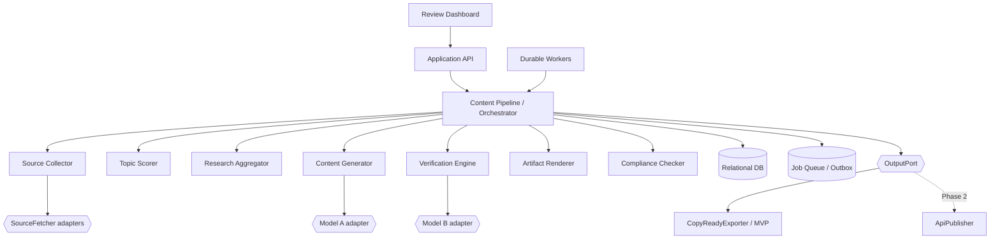

# Design Document: FB_AI

## Overview

FB_AI is a human-in-the-loop content production platform for AI-topic channels (Facebook Page, Facebook Group, and YouTube). It discovers material from permitted sources, ranks topics, aggregates attributable research, generates multi-format content, verifies claims with an independent model, checks the exact platform artifacts for compliance, and requires explicit human approval before any output.

This revision makes five integrity rules authoritative:

1. `Content_Pipeline` is the orchestrator; processors do not advance state themselves.
2. Content workflow state and per-target delivery state are separate.
3. Every edit creates an immutable draft revision and invalidates later checks.
4. Verification, compliance, approval, and delivery refer to the exact revision/artifact hash they evaluated.
5. Retryable, blocked, failed-validation, and terminal rejection outcomes are distinct.

## Scope and Phasing

### Phase 1 — MVP

```text
Collect → Score → Research → Generate revision → Verify claims
→ Render platform artifacts → Check compliance → Human review
→ Approve exact artifacts → Export copy-ready bundles
```

The Operator copies exported content and posts it manually. Phase 1 makes no external platform write calls and stores no publishing credentials.

### Phase 2 — Future

Phase 2 adds official-API publishing, Facebook Group scheduling/engagement, and encrypted credentials. It reuses approved immutable artifacts and adds delivery adapters and durable jobs without changing the content workflow through `Approved`.

### Requirement alignment decisions

The requirements use `Published` as the final pipeline stage and also require several recoverable failures to remain at a safe stage. To remove the resulting ambiguity, implementation uses:

- `WorkflowStage` for content maturity through `Approved`.
- `DeliveryStatus` for `Exported`, `Publishing`, `Published`, `Deferred`, and `Failed` per target.
- `WorkStatus` for retryable or human-fixable outcomes.
- `Rejected` only for explicit Operator rejection or a declared non-recoverable failure.

Thus Requirement 7's ordered content stages are preserved through `Approved`; its Phase 2 `Published` outcome is represented by a successful delivery record. Phase 1 uses `Exported`. Requirement 7.3 applies only to terminal failure, not to the recoverable cases explicitly defined by Requirements 2–6 and 9.
## Architecture

### Technology choices

- **Runtime:** TypeScript on Node.js.
- **Dashboard:** React SPA served behind the backend API.
- **Persistence:** relational database. SQLite is allowed only for single-process local MVP; Postgres is the production reference. Migrations and repository integration tests must run against every supported engine.
- **Durable execution:** a database-backed job table for MVP; a dedicated queue may replace it later behind `JobQueue`.
- **AI providers:** independent `ModelClient` adapters for Model A and Model B. Provider, model, prompt, and configuration versions are recorded.
- **Testing:** Vitest, `fast-check` for deterministic invariants, adapter contract tests, and database/integration tests.

### Component diagram

`Content_Pipeline` owns orchestration, state guards, transactions, timeouts, idempotency, and audit events.



Processors return typed results and artifacts. They never mutate `WorkflowStage` directly. The pipeline commits a processor result, its evidence references, the transition, and any next job in one transaction.

## State and Revision Model

### Content workflow

```typescript
type WorkflowStage =
  | "Collected"
  | "Scored"
  | "Researched"
  | "Generated"
  | "Verified"
  | "ComplianceChecked"
  | "PendingApproval"
  | "Approved"
  | "Rejected";

type WorkStatus =
  | "Ready"
  | "InProgress"
  | "RetryableBlocked"
  | "Unscored"
  | "InsufficientData"
  | "VerificationBlocked"
  | "ComplianceFailed"
  | "Rejected";
```

The successful order is strict:

```text
Collected → Scored → Researched → Generated → Verified
→ ComplianceChecked → PendingApproval → Approved
```

`Rejected` is a terminal side state. `WorkStatus` explains why an item has not advanced without pretending that a recoverable problem completed or terminally rejected a stage.

### Per-target delivery

```typescript
type DeliveryKind = "Export" | "Publish";
type DeliveryStatus =
  | "Pending"
  | "Exported"
  | "Publishing"
  | "Published"
  | "Deferred"
  | "Failed"
  | "Cancelled";
```

A draft has one content workflow and zero or more independent delivery records. Facebook may export successfully while YouTube fails compliance or delivery. Delivery never changes the approved content revision.

### Transition rules

| From | Event/result | To/status |
|---|---|---|
| Collected | valid score at/above threshold | Scored / Ready |
| Collected | missing scoring input | Collected / Unscored |
| Scored | sufficient research | Researched / Ready |
| Scored | insufficient/origin unavailable | Scored / InsufficientData |
| Researched | all formats generated | Generated / Ready |
| Generated | all source-backed claims pass | Verified / Ready |
| Generated | contradictions remain | Generated / VerificationBlocked |
| Verified | every selected artifact passes | ComplianceChecked / Ready |
| Verified | any selected artifact fails | Verified / ComplianceFailed |
| ComplianceChecked | review package persisted | PendingApproval / Ready |
| PendingApproval | Operator edits | Generated / Ready, new revision |
| PendingApproval | explicit valid approval | Approved / Ready |
| PendingApproval | explicit rejection with note | Rejected / Rejected |
| Any nonterminal | retryable dependency failure | same stage / RetryableBlocked |
| Any nonterminal | declared non-recoverable failure | Rejected / Rejected |

An automatic operation exceeding its 300-second stage deadline is classified by policy. It is retryable while attempts remain; only exhaustion of the configured stage retry budget becomes terminal rejection. This preserves Requirements 5.7 and 7.7 without losing recoverability.
### Immutable revisions and approval integrity

Every generated or Operator-edited version is immutable.

```typescript
interface DraftRevision {
  id: string;
  draftId: string;
  revision: number;
  parentRevisionId?: string;
  content: ContentDraft;
  contentHash: string;          // SHA-256 of canonical content
  createdBy: "System" | "Operator";
  actorId?: string;
  createdAt: string;
}

interface ApprovalRecord {
  id: string;
  pipelineRunId: string;
  draftRevisionId: string;
  contentHash: string;
  approvedArtifactIds: string[];
  approvedArtifactHashes: string[];
  operatorId: string;
  approvedAt: string;
}
```

An edit at `PendingApproval` creates revision `N+1`, clears the active approval, invalidates verification/compliance eligibility for the old revision, and returns the workflow to `Generated`. Old reports remain available for audit but cannot authorize the new revision.

Approval is accepted only if:

- the item is at `PendingApproval` and its optimistic-lock version matches;
- verification passed for the active draft revision;
- every selected artifact passed compliance;
- report revision IDs and stored hashes match the active revision/artifacts;
- the request names an authenticated Operator and is explicit.

Delivery is accepted only for artifacts listed in an `ApprovalRecord`, with matching hashes. Rendering after approval is forbidden.

## Components and Interfaces

### Source Collector (Requirement 1)

```typescript
interface SourceFetcher {
  fetch(source: SourceConfig, cursor: SourceCursor | undefined, signal: AbortSignal): Promise<FetchPage>;
  isAllowed(source: SourceConfig): Promise<SourcePermission>;
}

interface CollectionOptions {
  windowHours: number;          // 1..720, default 24
  perRequestTimeoutMs: number;  // <= 30,000
  maxRetries: number;           // 1..5, default 3
  maxConcurrency: number;
  cycleDeadlineMs: number;
  perProviderConcurrency: Record<string, number>;
}
```

Collection uses bounded concurrency, provider/domain rate limits, a cycle work budget, exponential backoff with jitter, and per-source checkpoints. `ETag`/`Last-Modified` are used where supported. A process restart resumes from durable cursors instead of restarting all sources.

The primary idempotency constraint is `(sourceId, externalId)`. Canonical URL and normalized content hash are fallback duplicate signals, never `sourceId` alone. Disallowed sources are skipped with the terms/robots reason and effective version. One source failure does not roll back successful items from others.

### Topic Scorer (Requirement 2)

Scoring remains a deterministic weighted sum. Weights must sum to 100; components and totals are bounded to `[0,100]`. Missing inputs produce `Unscored`, not `Rejected`. Ranking uses score descending and creation time descending as the tie-break. The complete criterion breakdown and scoring configuration version are persisted.

### Research Aggregator (Requirement 3)

```typescript
type ResearchKind = "Quoted" | "Summarized" | "Inferred";

interface ResearchItem {
  id: string;
  content: string;
  kind: ResearchKind;
  evidenceRefs: SourceReference[];
  modelProvenance?: {
    provider: string;
    model: string;
    promptVersion: string;
    confidence?: number;
  };
}

interface ResearchResult {
  id: string;
  topicId: string;
  items: ResearchItem[];
  status: "Ok" | "InsufficientData";
  reason?: string;
  unreachableSources: SourceReference[];
}
```

Quoted and summarized items must cite one or more source captures. Inferred items must cite their context sources and model provenance, but they are not accepted as independent factual evidence during verification. The origin source is mandatory. Related-source timeouts are recorded and skipped; the overall deadline is 60 seconds.

### Content Generator (Requirement 4)

Model A generates a new `DraftRevision` containing the Facebook post, structured guide, video script, origin links, language, and brand-voice version. All three formats are validated before transition to `Generated`; partial output remains stored for diagnosis but does not advance. Generation records provider/model, prompt version, research result ID, and deterministic input hash.

### Claim manifest and cross-verification (Requirement 5)

```typescript
interface Claim {
  id: string;
  draftRevisionId: string;
  format: "FacebookPost" | "Guide" | "VideoScript";
  path: string;
  startOffset: number;
  endOffset: number;
  text: string;
}

interface VerificationFinding {
  claimId: string;
  verdict: "Pass" | "Contradiction" | "Unsupported";
  evidenceRefs: SourceReference[];
  description?: string;
  confidence?: number;
}

interface VerificationReport {
  id: string;
  draftRevisionId: string;
  contentHash: string;
  researchResultId: string;
  round: number;
  modelB: { provider: string; model: string; promptVersion: string };
  findings: VerificationFinding[];
  passed: boolean;
}
```

The deterministic claim extractor creates stable locations for factual claims in all formats. Model B evaluates each claim only against source-backed research. `Inferred` research can provide context but cannot by itself produce `Pass`.

The bounded correction loop is explicit:

```text
extract claims for revision N
→ Model B verifies every claim
→ if all pass: mark revision Verified
→ otherwise, if round < maxRounds:
     Model A creates revision N+1 addressing findings
     extract a new claim manifest and verify N+1
→ otherwise: Generated / VerificationBlocked
```

`maxRounds` is 1–5, default 2. Every revision and report is retained. A model timeout retries at most three times according to the retry policy; exhaustion leaves the item `Generated / RetryableBlocked` and notifies the Operator. No model is permitted to advance state.
### Platform artifact renderer

Compliance and approval operate on the exact bytes intended for output.

```typescript
interface PlatformArtifact {
  id: string;
  draftRevisionId: string;
  platform: TargetPlatform;
  rendererVersion: string;
  body: string;
  metadata: Record<string, string>;
  attribution: string;
  imageSuggestions: ImageSuggestion[];
  artifactHash: string;
  createdAt: string;
}
```

Rendering occurs after verification and before compliance. Facebook artifacts use the Facebook post plus required attribution. YouTube artifacts use the script and metadata. Artifacts are immutable; any renderer/config/content change creates a new artifact and requires compliance and approval again.

### Compliance Checker (Requirement 6)

Rules are declarative and versioned rather than executable functions stored as configuration.

```typescript
interface ComplianceRuleDefinition {
  id: string;
  platform: TargetPlatform;
  version: string;
  kind: "Keyword" | "Pattern" | "Classifier" | "Attribution" | "Copyright";
  parameters: Record<string, unknown>;
  effectiveFrom: string;
  effectiveTo?: string;
}

interface ComplianceResult {
  id: string;
  artifactId: string;
  artifactHash: string;
  draftRevisionId: string;
  platform: TargetPlatform;
  ruleSetVersion: string;
  sourceTermsVersions: string[];
  evaluatorVersion: string;
  passed: boolean;
  violatedRuleIds: string[];
  attributionOk: boolean;
  copyrightOk: boolean;
  reasons: string[];
  checkedAt: string;
}
```

The evaluator checks every active rule for the platform within 30 seconds. Missing rules or Source Terms fail closed as `ComplianceFailed`; they do not reject or mutate the draft.

Copyright comparison uses a documented deterministic pipeline: Unicode NFKC normalization, HTML-to-text conversion, locale-aware case folding, and word segmentation via a pinned tokenizer version supporting Vietnamese. It compares contiguous normalized token runs and total matched draft tokens against all captured origin sources. Defaults are 50 consecutive words or 20% of draft words. Properly marked quotations, code blocks, and licensed excerpts are not silently ignored: exceptions require an explicit rule, license reference, and attribution, all recorded in the result.

A platform failure blocks only that target. The Operator may remove the target, revise the draft, or request recheck after rule configuration is restored. Only passing artifacts can enter an approval record.

### Content Pipeline (Requirement 7)

Generic unguarded `advance(item)` is prohibited. The application exposes intent-specific commands:

```typescript
interface ExpectedState {
  pipelineRunId: string;
  expectedVersion: number;
  expectedStage: WorkflowStage;
}

interface ContentPipeline {
  completeScoring(cmd: ExpectedState & { scoreId: string }): Promise<PipelineRun>;
  completeResearch(cmd: ExpectedState & { researchResultId: string }): Promise<PipelineRun>;
  completeGeneration(cmd: ExpectedState & { draftRevisionId: string }): Promise<PipelineRun>;
  completeVerification(cmd: ExpectedState & { reportId: string }): Promise<PipelineRun>;
  completeCompliance(cmd: ExpectedState & { artifactResultIds: string[] }): Promise<PipelineRun>;
  submitForReview(cmd: ExpectedState): Promise<PipelineRun>;
  approve(cmd: ExpectedState & ApprovalCommand): Promise<ApprovalRecord>;
  reject(cmd: ExpectedState & { operatorId: string; note: string }): Promise<PipelineRun>;
}
```

Each command checks adjacent stage, evidence ownership, pass status, active revision/hash, target policy, and optimistic-lock version. It then persists artifacts, transition event, run version, and next job atomically. Duplicate commands with the same idempotency key return the original result.

### Review Dashboard (Requirement 8)

The dashboard lists pending and blocked work and shows the active revision, claim-level report, compliance per platform, and audit history. Operator actions require authentication and role authorization.

- Editing is allowed only at `PendingApproval`, enforces field limits, creates a new immutable revision, and returns to `Generated` for re-verification.
- Approval uses an explicit confirmation and exact artifact selection. Stale revision/version requests return conflict rather than overwriting another Operator's work.
- Rejection requires a 1–1,000 character note.
- Save failure rolls back the transaction and leaves the prior active revision unchanged.
- The UI clearly labels old reports as superseded and never presents them as valid for the active revision.
- CSRF protection, secure cookies/session expiry, output encoding, and rate limiting apply to mutation endpoints.

```typescript
interface ReviewDashboardApi {
  listReviewQueue(filter?: ReviewQueueFilter): Promise<ReviewSummary[]>;
  getReviewPackage(id: string): Promise<ReviewPackage>;
  editDraft(id: string, expectedVersion: number, patch: DraftPatch): Promise<DraftRevision>;
  approve(id: string, command: ApprovalCommand): Promise<ApprovalRecord>;
  reject(id: string, expectedVersion: number, note: string): Promise<PipelineRun>;
  listDeliveries(id: string): Promise<DeliveryRecord[]>;
}
```
### Output port and delivery records

```typescript
interface DeliveryCommand {
  approvalId: string;
  artifactId: string;
  artifactHash: string;
  targetId: string;
  idempotencyKey: string;
}

interface DeliveryOutcome {
  status: DeliveryStatus;
  externalId?: string;
  externalUrl?: string;
  exportedBundleId?: string;
  retryAt?: string;
  errorCode?: string;
  errorMessage?: string;
}

interface OutputPort {
  deliver(command: DeliveryCommand): Promise<DeliveryOutcome>;
}

interface DeliveryRecord {
  id: string;
  kind: DeliveryKind;
  platform: TargetPlatform;
  targetId: string;
  approvalId: string;
  artifactId: string;
  artifactHash: string;
  idempotencyKey: string;
  status: DeliveryStatus;
  attempts: number;
  nextAttemptAt?: string;
  externalId?: string;
  externalUrl?: string;
  createdAt: string;
  updatedAt: string;
}
```

`CopyReadyExporter` creates a bundle from the already rendered and approved artifact; it does not re-render. `ApiPublisher` sends the same approved artifact in Phase 2. The unique idempotency key is derived from delivery kind, revision, artifact, platform, and target account/group. Repeated execution cannot create a second logical delivery.

## Data Models

```typescript
type TargetPlatform = "Facebook_Page" | "Facebook_Group" | "YouTube";

interface SourceConfig {
  id: string;
  type: "GitHub" | "Website" | "Forum";
  url: string;
  active: boolean;
  priority: number;
  filterMode: "Best" | "High" | "All";
}

interface SourceCursor {
  sourceId: string;
  cursor?: string;
  etag?: string;
  lastModified?: string;
  updatedAt: string;
}

interface SourcePermission {
  allowed: boolean;
  reason?: string;
  termsVersion: string;
  robotsCapturedAt: string;
}

interface FetchPage {
  items: RawItem[];
  nextCursor?: SourceCursor;
}

interface ScoreBreakdown {
  criterionId: string;
  componentValue: number;
  weightPercent: number;
}

interface TopicScore {
  total: number | null;
  breakdown: ScoreBreakdown[];
  scoringConfigVersion: string;
  unscoredReason?: string;
}

interface Topic {
  id: string;
  sourceRef: SourceReference;
  externalId: string;
  title: string;
  createdAt: string;
  score: TopicScore;
  categories: string[];
}

interface ImageSuggestion { description: string; }
interface GuideSection { heading: string; body: string; imageSuggestions: ImageSuggestion[]; }
interface VideoScript { intro: string; body: string; conclusion: string; }

interface ContentDraft {
  topicId: string;
  facebookPost: string;       // 50..5,000 characters
  guide: GuideSection[];      // at least three sections
  videoScript: VideoScript;
  originLinks: string[];
  language: string;           // default vi
  brandVoiceVersion?: string;
}

interface ApprovalCommand {
  operatorId: string;
  draftRevisionId: string;
  contentHash: string;
  artifactIds: string[];
  artifactHashes: string[];
  confirmed: true;
}

interface DraftPatch { content: ContentDraft; }
interface ReviewQueueFilter { status?: WorkStatus; platform?: TargetPlatform; }
interface ReviewSummary { pipelineRunId: string; stage: WorkflowStage; status: WorkStatus; version: number; }
interface ReviewPackage {
  run: PipelineRun;
  revision: DraftRevision;
  verification: VerificationReport;
  artifacts: PlatformArtifact[];
  compliance: ComplianceResult[];
}

interface PipelineRun {
  id: string;
  topicId: string;
  activeDraftRevisionId?: string;
  stage: WorkflowStage;
  workStatus: WorkStatus;
  version: number;
  categories: string[]; // 1..5 from the configured set
  blockedReason?: string;
  createdAt: string;
  updatedAt: string;
}

interface PipelineTransition {
  id: string;
  pipelineRunId: string;
  fromStage: WorkflowStage;
  toStage: WorkflowStage;
  fromStatus: WorkStatus;
  toStatus: WorkStatus;
  actorType: "System" | "Operator";
  actorId?: string;
  artifactRevisionId?: string;
  reason?: string;
  idempotencyKey: string;
  createdAt: string;
}

interface SourceReference {
  sourceId: string;
  captureId: string;
  url: string;
  capturedAt: string;
  termsVersion: string;
}

interface RawItem {
  sourceId: string;
  externalId: string;
  canonicalUrl?: string;
  normalizedContentHash: string;
  publishedOrUpdatedAt: string;
  title: string;
  body: string;
  github?: { stars: number; lastUpdatedAt: string; changelog?: string };
}
```

`PipelineRun` is the only canonical current workflow state. Topic, research, drafts, reports, and artifacts do not duplicate mutable stage fields. Their IDs are linked to transition events for history and explainability.

### Persistence constraints

- Unique source item: `(source_id, external_id)`; canonical URL/content hash are indexed fallback signals.
- Unique draft revision: `(draft_id, revision)` and immutable `content_hash`.
- Unique transition idempotency key per pipeline run.
- Unique delivery idempotency key.
- One active revision per pipeline run.
- Approval references passing verification and compliance records for the exact hashes.
- Foreign keys prevent deleting evidence used by approval/delivery; retention uses archival, not destructive cascade.
- All timestamps are UTC; API rendering localizes them only at the edge.
- Rule sets, Source Terms, tokenizer, model, prompt, renderer, and evaluator versions are retained for reproducibility.

Transactions use optimistic locking on `PipelineRun.version`. A transition, audit event, and enqueued follow-up job/outbox message commit together.

## Durable Execution, Retries, and Loop Bounds

All asynchronous work is represented by durable jobs with `Pending`, `Leased`, `Succeeded`, `RetryScheduled`, or `DeadLettered` status. Workers use lease expiry and heartbeat so a crashed process can safely resume work.

Retry policy distinguishes retryable errors (timeouts, 429, selected 5xx/network failures) from permanent errors (invalid configuration, forbidden source, invalid request). Retries use exponential backoff with jitter and a maximum attempt/deadline budget. Provider-specific concurrency and rate-limit state are shared through durable storage.

Bounded loops are:

- source fetch: 1–5 attempts per request and a global cycle deadline;
- verification: 1–5 correction rounds, up to three model-call attempts per round;
- Phase 2 publish: up to three immediate policy attempts, then `Deferred` when the platform supplies a valid retry time;
- scheduled work and metrics: each occurrence is a distinct idempotent job, not an in-process infinite loop.

`Deferred` work must have `nextAttemptAt`; `RetryableBlocked` work requires explicit retry policy or Operator action. Jobs exceeding their total budget go to a dead-letter queue and notify the Operator. They do not silently spin.
## Phase 2 Design

### API Publisher (Requirement 9)

The publisher consumes only an approved artifact and creates/updates its `DeliveryRecord`. Before sending, it rechecks approval/hash, credential status, external-write confirmation, rate policy, and idempotency key. Success stores platform post ID/URL and marks only that delivery `Published`. A timeout after sending is reconciled by idempotency lookup where the platform supports it; otherwise the delivery enters manual reconciliation rather than blindly reposting.

### Group Manager (Requirement 10)

Schedules are durable recurrence definitions. Every occurrence creates a unique delivery job. Comment ingestion stores platform cursor/webhook IDs to deduplicate events. A response draft follows its own revision, verification/compliance, and explicit approval flow before sending. Metrics snapshots are timestamped and refreshed by idempotent hourly jobs.

### Credential Store (Requirement 11)

- Tokens are encrypted at rest with envelope encryption and a managed key provider in production.
- Secrets are never logged, returned by list APIs, or stored in job payloads.
- The dashboard shows credential ID and at most four trailing characters.
- Invalid/expired/revoked credentials atomically become `ReauthorizationRequired`; related deliveries are deferred and not retried with the same invalid token beyond policy.
- External write confirmation expires after 300 seconds and is bound to actor, target, artifact hash, and action.
- Key access, credential changes, confirmations, and writes are audited.

## Security and Operations

### Authorization and audit

Minimum roles are `Operator` and `Admin`. Operators review/edit/approve; Admins additionally manage sources, rules, targets, and credentials. Every mutation records actor, request/correlation ID, old/new version, affected revision/artifact, and timestamp. Service-to-service operations use scoped identities.

### Observability

Structured logs, metrics, and traces include pipeline run/job IDs but exclude content where unnecessary and always exclude secrets. Required metrics include stage latency, queue age, retry count, source success rate, verification rounds/blocked rate, compliance failures by rule, stale review count, delivery outcome, and dead-letter depth. Alerts cover stuck leases, deadline breaches, credential failures, and repeated delivery errors.

### Data protection

Transport encryption is mandatory outside local development. Database backups, retention, restoration tests, and deletion policies are documented. Content/source captures are treated as untrusted data: HTML is sanitized, URLs are validated, fetched content cannot issue system instructions, and model prompts delimit source data from application instructions.

## Error Handling

| Category | Examples | Result |
|---|---|---|
| Retryable dependency | network timeout, 429, selected 5xx | same stage + `RetryableBlocked`; schedule bounded retry |
| Insufficient input | missing score field, too little research | `Unscored` or `InsufficientData`; Operator can fix/retry |
| Verification failure | unsupported/contradictory claims after max rounds | `VerificationBlocked`; edit/retry required |
| Compliance failure | rule, attribution, copyright, missing config | `ComplianceFailed` for affected artifact/target |
| Validation/conflict | invalid command, stale version/hash | reject command; workflow unchanged |
| Operator rejection | valid explicit rejection note | terminal `Rejected` |
| Non-recoverable system failure | exhausted policy and declared terminal | terminal `Rejected`, preserve all data |
| Delivery failure | publish/export adapter error | delivery `Deferred` or `Failed`; content stays `Approved` |

No failure deletes prior content or evidence. Operator notifications are deduplicated by event key and link to actionable context.

## Correctness Properties

The following properties are implementation invariants. The test type is selected by behavior rather than forcing every property into property-based testing.

### Property 1: Collection is bounded, permitted, and idempotent

For any collection cycle, every accepted item is within the configured time window, every `(sourceId, externalId)` is unique, replay creates no additional topic, source permission metadata is retained, and one failing/disallowed source does not discard or block successful sources.

**Validates: Requirements 1.1, 1.2, 1.4, 1.5, 1.6, 1.7**

### Property 2: Scoring and ranking are deterministic

For any valid criteria whose weights total 100, the weighted score is exact and within `[0,100]`; ranking is descending with newer-first ties, threshold filtering is exact, and missing input produces `Unscored` without advancement.

**Validates: Requirements 2.1, 2.2, 2.3, 2.4, 2.6**

### Property 3: Research has usable provenance

Every quote/summary has source evidence; every inference has context evidence and model provenance; inference alone cannot substantiate a factual pass; insufficient data or an unavailable origin never advances.

**Validates: Requirements 3.2, 3.3, 3.4, 3.6, 5.2**

### Property 4: Generated revisions satisfy every format contract

A successful revision satisfies all Facebook, guide, video, language, origin-link, and image-suggestion constraints. Partial generation preserves diagnostics and remains at `Researched`.

**Validates: Requirements 4.1, 4.2, 4.3, 4.5, 4.6**

### Property 5: Revisions are immutable and monotonic

For any draft, revision numbers increase monotonically, prior content/hash values never change, and a report or approval for revision N cannot authorize revision N+1.

**Validates: Requirements 5.8, 6.6, 8.8, 8.9**

### Property 6: Verification covers every extracted claim

Every factual claim in every format has exactly one finding. Contradiction/unsupported findings include evidence and explanation, and only an exact revision with no such findings can become `Verified`.

**Validates: Requirements 5.1, 5.2, 5.3, 5.4, 5.5, 5.8**

### Property 7: Verification loops are bounded

Verification never exceeds `maxRounds`; unresolved work becomes `VerificationBlocked`, remains visible, and is never auto-approved.

**Validates: Requirements 5.6, 5.7**

### Property 8: Compliance checks exact artifacts

Every compliance result names the exact artifact/revision hashes and rule, Source Terms, tokenizer, renderer, and evaluator versions. `passed` is true exactly when all active rules, attribution, and copyright checks pass.

**Validates: Requirements 6.1, 6.2, 6.3, 6.4, 6.6, 6.7**

### Property 9: Copyright boundaries are deterministic

Under the pinned normalization/tokenizer, 49 versus 50 consecutive copied words and 19% versus 20% total matched words produce the configured boundary outcomes reproducibly.

**Validates: Requirements 6.5**

### Property 10: Editing invalidates downstream gates

Any accepted edit at `PendingApproval` creates a new revision, removes eligibility of prior verification/compliance/approval records, and returns the workflow to `Generated`.

**Validates: Requirements 5.1, 5.5, 6.1, 8.2, 8.8, 8.9**

### Property 11: Approval and delivery are hash-bound

Approval requires an authenticated explicit action, current optimistic version, passing exact-revision report, and passing selected artifact hashes. No artifact outside that approval record can be exported or published.

**Validates: Requirements 7.5, 7.6, 8.3, 8.6, 8.7, 9.1**

### Property 12: Deliveries are independent and idempotent

Replaying one delivery idempotency key creates at most one logical delivery, and failure for one target cannot alter approved content or unrelated target deliveries.

**Validates: Requirements 8.6, 9.1, 9.3, 9.4, 9.5, 9.6**

### Property 13: Workflow transitions are guarded and adjacent

Every successful workflow transition moves exactly one adjacent stage and carries required evidence. A recoverable failure does not become terminal rejection before its declared budget is exhausted.

**Validates: Requirements 7.1, 7.2, 7.3, 7.7**

### Property 14: Concurrent mutations are serialized

For concurrent commands using one expected pipeline version, at most one mutation succeeds; stale commands make no state or artifact change.

**Validates: Requirements 7.2, 8.2, 8.3, 8.8, 8.9**

### Property 15: Transactions and worker recovery preserve exactly-once effects

A committed transition always has its audit event and follow-up job/outbox record. Lease expiry after worker failure can re-execute work without duplicate logical collection, transition, notification, or delivery effects.

**Validates: Requirements 1.5, 1.7, 7.2, 9.3, 9.4, 9.5, 9.6**

### Property 16: Rejection and blocking preserve evidence

Rejection preserves every existing draft, report, artifact, and transition. Every blocked or terminal state has a visible reason and a defined retry, edit, configuration, reconciliation, or rejection action.

**Validates: Requirements 5.6, 5.7, 5.8, 6.2, 6.6, 6.7, 7.3, 8.4**

## Testing Strategy

### Property-based tests

Use `fast-check` for deterministic invariants with broad generated input spaces:

- scoring bounds, weight normalization, ranking, and threshold filtering;
- collection time windows and deduplication;
- text/field boundaries and Vietnamese Unicode inputs;
- revision monotonicity and legal state transitions;
- copyright token/run/percentage boundaries;
- approval/hash and idempotency gates.

Each property runs at least 100 cases and records its invariant number. Generators include empty/whitespace and non-ASCII text, exact boundaries, duplicate/reordered events, stale versions, and independent platform outcomes.

### Unit and contract tests

Use example-based tests for claim extraction paths, rule evaluators, renderers, retry classification/backoff, command guards, notification deduplication, and adapter contracts. Fake models and source/platform adapters must return deterministic fixtures.

### Integration tests

Required scenarios:

1. End-to-end MVP happy path through approved immutable artifact and `Exported` delivery.
2. Operator edit at `PendingApproval` creates a new revision and forces verification/compliance again.
3. Stale concurrent approve/edit requests produce one success and one conflict.
4. Transaction rollback leaves no transition without audit/job and no job without transition.
5. Worker crash/lease expiry resumes without duplicate collection or delivery.
6. One platform compliance/delivery failure does not block another passing target.
7. Persistence round-trip retains score, provenance, model/prompt/rule/terms versions, reports, artifacts, and audit history.
8. Repository/migration tests run against SQLite if supported and Postgres.

Phase 2 adds mocked official-API tests for success, timeout reconciliation, rate-limit deferral, invalid credentials, confirmation expiry, webhook/comment deduplication, and scheduled-job recovery. External services themselves are not property-tested.

## Implementation Sequence

1. **Domain/state foundation:** enums, immutable revisions, artifact hashes, delivery records, transition table, failure taxonomy.
2. **Persistence:** migrations, constraints, repositories, optimistic locking, audit log, job/outbox transaction.
3. **Source and scoring:** permission snapshots, dedup/cursors, bounded collector, deterministic scorer.
4. **Research and generation:** evidence provenance, model metadata, structured drafts and revision creation.
5. **Verification:** claim extractor, bounded correction loop, revision-bound reports and blocked handling.
6. **Artifacts and compliance:** deterministic renderers, declarative/versioned rules, tokenizer, per-platform eligibility.
7. **Dashboard:** authentication/RBAC, review package, edit reset flow, conflict handling, exact-hash approval.
8. **MVP delivery:** approved-artifact exporter and per-target delivery history.
9. **Reliability/security:** crash recovery, dead letters, observability, backup/restore and security tests.
10. **Phase 2 only:** credential store, confirmations, API publisher, scheduler/group manager, reconciliation.

A separate `tasks.md` should decompose these steps and link each task to requirements and correctness invariants before implementation begins.

## Final Design Guarantees

- There is no unbounded processing loop; retries, correction rounds, schedules, and polling are durable and bounded/idempotent.
- Operator edits cannot bypass verification or compliance.
- The exact approved bytes are the bytes exported or published.
- Content workflow cannot become inconsistent with independent platform deliveries.
- Recoverable failures remain actionable instead of being prematurely discarded.
- Every important decision is reproducible from immutable content, evidence, configuration versions, hashes, and audit history.